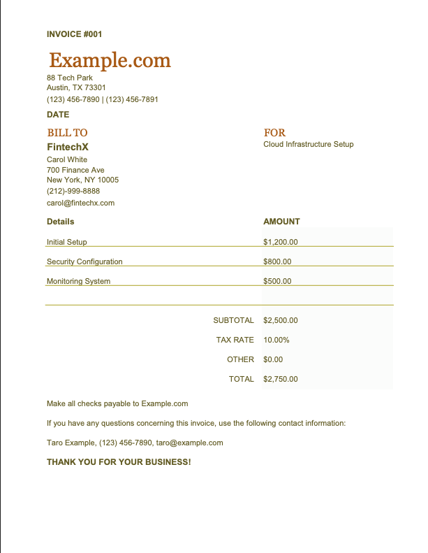
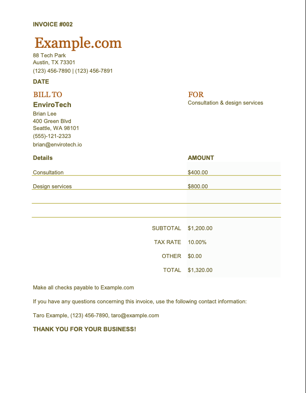

# ExcelFilesToOneCsv

複数のExcelファイルから特定のセルを抽出し、1つのCSVファイルにまとめるツールです。  
`config.ini` に設定されたセル位置とヘッダー名を元に、指定フォルダ配下のExcelファイルを処理します。

### 対象ファイル例





### 出力ファイル例


---

## 使い方

1. `config.ini` に作業フォルダパス、シート名、セル位置などを記述します。
2. 作業フォルダに対象のExcelファイル（`.xlsx`, `.xls`, `.xlsm`）をすべてコピーします。
3. `ExcelFilesToOneCsv.exe` を `config.ini` と同じフォルダに置いて実行すると、作業フォルダ内にCSVファイルが出力されます。

---

## config.ini の例

```ini
[Settings]
WorkingFolderPath = ./input
SheetName = Sheet1
OutputFileName = result.csv

[Cells]
Name = A1
Age = B1
Address = C1
```

- `WorkingFolderPath`：Excelファイルを格納するディレクトリ
- `SheetName`：対象のシート名（または `SheetNumber` を1から指定可能）
- `Cells`：CSVのカラム名 = Excelのセル番地

---

## 注意事項

- `config.ini` は UTF-8（BOM付き）で保存してください。
- `SheetName` が指定されていない場合は、`SheetNumber`（1から始まる番号）が使われます。
- 対象外のファイル形式（例：`.csv`, `.txt`）は処理されません。
- セル番地が存在しない場合は、その列は `None` として出力されます。

---

## 開発者向けセットアップ手順

※ Python のバージョンは `.python-version` に従ってください（pyenv を使うと便利です）

### 1. 仮想環境の作成

```bash
python -m venv venv
```

### 2. 仮想環境のアクティベート

- Windows:
  ```bash
  .\venv\Scripts\activate
  ```
- Mac/Linux:
  ```bash
  source ./venv/bin/activate
  ```

### 3. ライブラリのインストール

```bash
pip install -r requirements.txt
```

### 4-a. example以下のファイルの変換

```bash
python main.py  
```

### 4-b. exe化（Windows環境でのみ）

```bash
pyinstaller main.py -n ExcelFilesToOneCsv --onefile --icon=icon.ico --console
```

出力された `dist/ExcelFilesToOneCsv.exe` を使用します。

