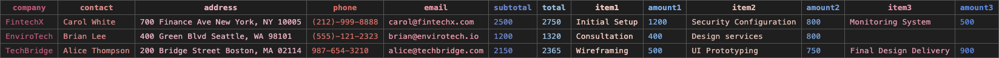

# ExcelFilesToOneCsv

This tool extracts specific cells from multiple Excel files and combines the data into a single CSV file.  
It processes Excel files under the specified folder based on cell positions and header names defined in `config.ini`.

### Example Input Files


### Example Output File



---

## Usage

1. Configure `config.ini` with the working folder path, sheet name or number, and target cell positions.
2. Copy all target Excel files (`.xlsx`, `.xls`, `.xlsm`) into the specified working folder.
3. Place `ExcelFilesToOneCsv.exe` in the same directory as `config.ini` and run it. A CSV file will be generated in the working folder.

---

## Example `config.ini`

```ini
[Settings]
WorkingFolderPath = ./input
SheetName = Sheet1
OutputFileName = result.csv

[Cells]
Name = A1
Age = B1
Address = C1
```

- `WorkingFolderPath`: Directory where Excel files are stored
- `SheetName`: Target sheet name (or use `SheetNumber`, starting from 1)
- `Cells`: CSV column name = Excel cell address

---

## Notes

- Save `config.ini` in UTF-8 with BOM encoding.
- If `SheetName` is not specified, `SheetNumber` (starting from 1) will be used instead.
- Unsupported file formats (e.g. `.csv`, `.txt`) will be ignored.
- If a specified cell does not exist, `None` will be output for that column.

---

## Developer Setup

※ Please follow the Python version specified in `.python-version` (using `pyenv` is recommended)

### 1. Create a virtual environment

```bash
python -m venv venv
```

### 2. Activate the virtual environment

- Windows:
  ```bash
  .\venv\Scripts\activate
  ```
- Mac/Linux:
  ```bash
  source ./venv/bin/activate
  ```

### 3. Install required libraries

```bash
pip install -r requirements.txt
```

### 4-a. Convert example files under the `example/` directory

```bash
python main.py
```

### 4-b. Build executable (Windows only)

```bash
pyinstaller main.py -n ExcelFilesToOneCsv --onefile --icon=icon.ico --console
```

The executable will be output to `dist/ExcelFilesToOneCsv.exe`.
